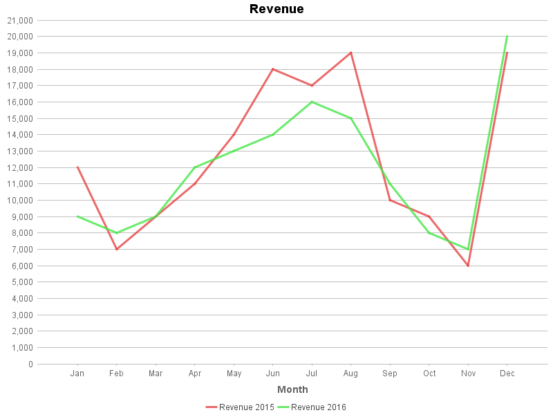
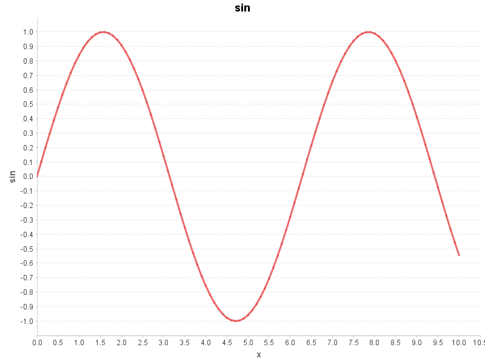
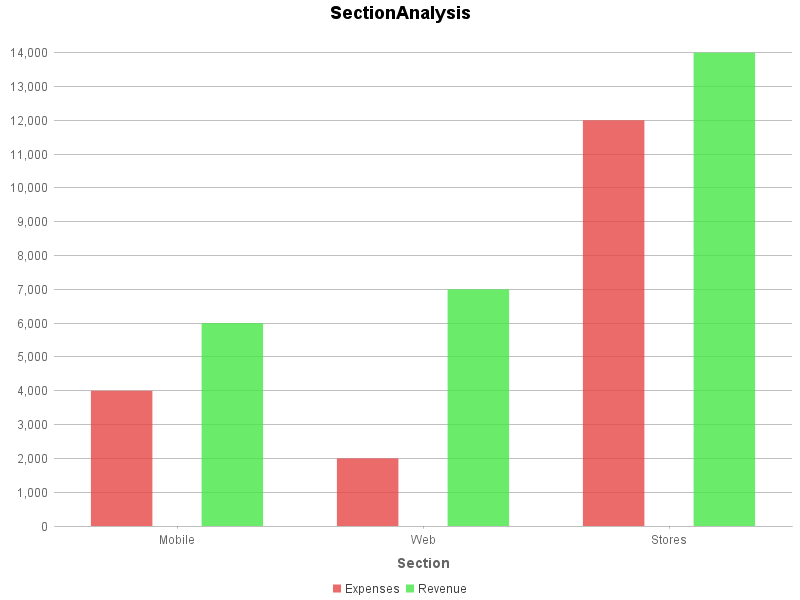
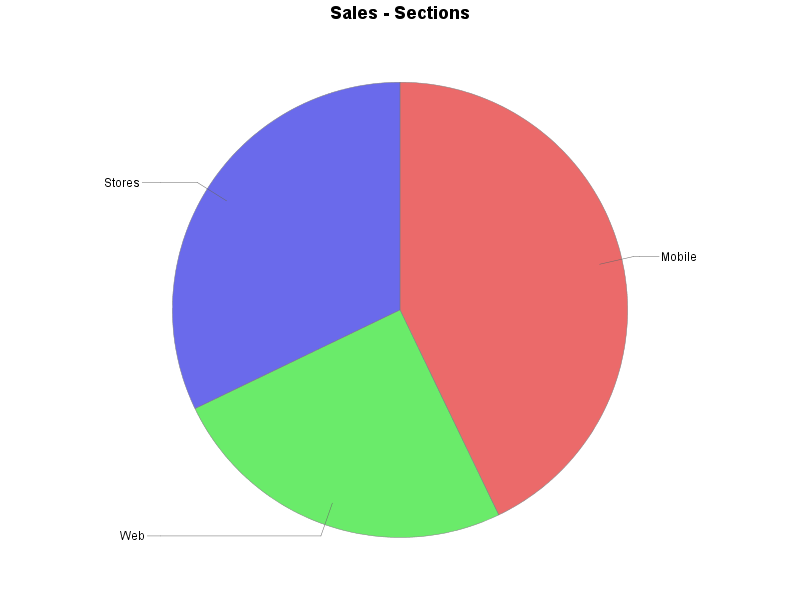
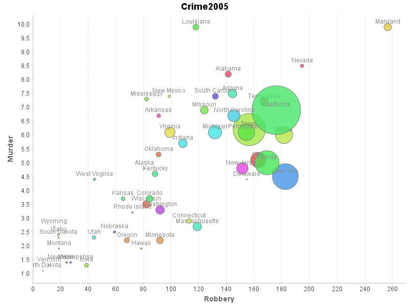
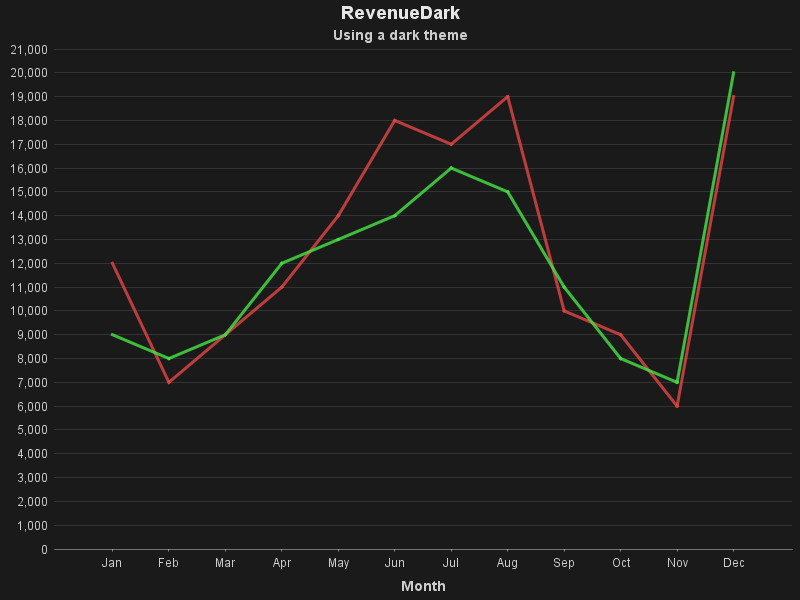
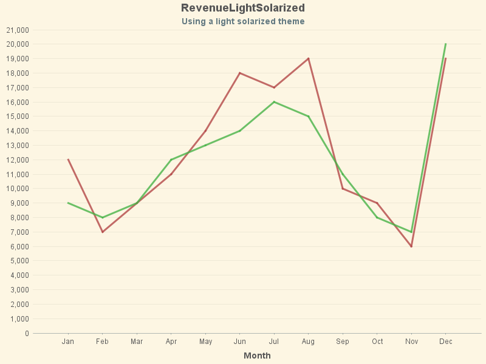
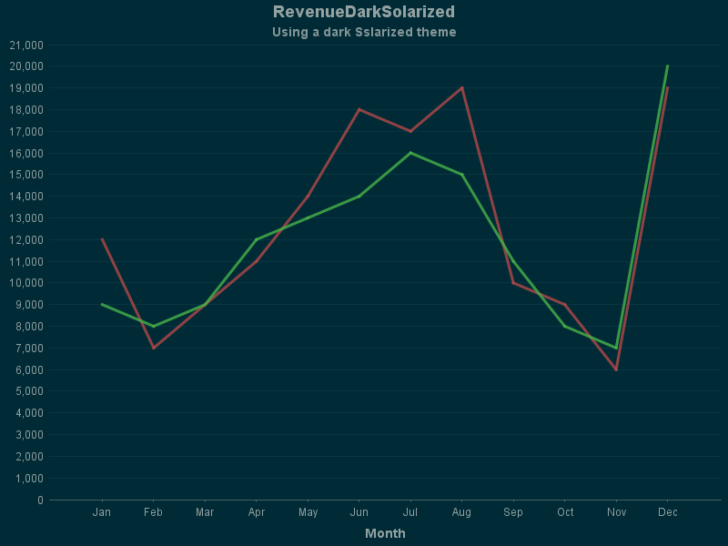
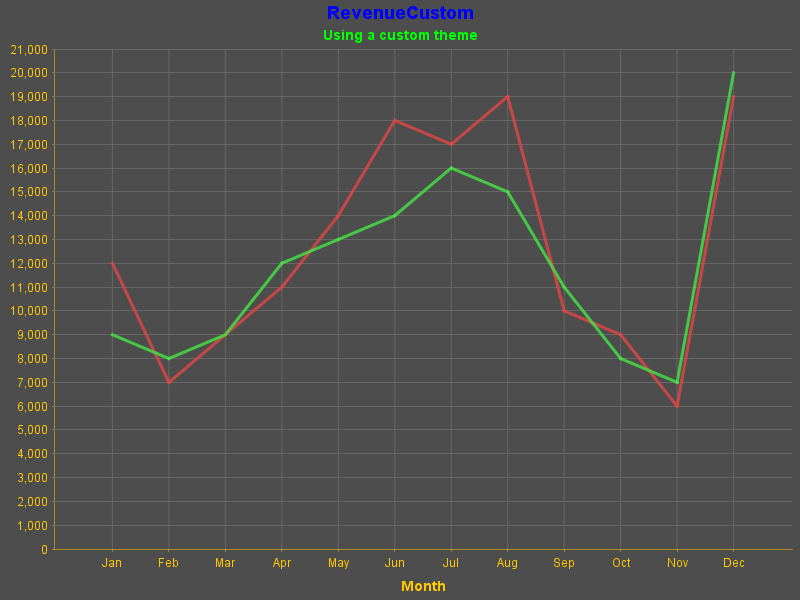

[](https://travis-ci.org/eobermuhlner/csv2chart)
[](https://codecov.io/gh/eobermuhlner/csv2chart)

# csv2chart

A simple command line tool to convert csv files into charts.

Chart rendering is done in JFreeChart.

The tool parses the csv file and decides which chart type to render based on the data, comments in the csv file, properties files and command line options.


## Installation

After downloading the distribution file from the releases, extract the content in an appropriate folder and set the PATH variable to the 'bin' directory of the extracted folder. 


## CSV Files

The command line tool is called with the list of csv files to be converted.

### Configuration in CSV File

Each csv file may contain leading comments to control the generated chart.

Example:
```csv
# csv2chart.title=Sales - Sections
# csv2chart.chart=pie
#
Section, Revenue
 Mobile,   12000
    Web,    7000
 Stores,    9000
```

### Configuration in Companion Properties File

It is also possible to put the options into a properties files with the same basename as the csv file.

File: `SectionAnalysis.csv`
```csv
Section, Expenses, Revenue
 Mobile,    4000,     6000
    Web,    2000,     7000         
 Stores,   12000,    14000
```

File: `SectionAnalysis.properties`
```properties
chart=bar
```

### Configuration in Shared Properties File `csv2chart.properties`

If many csv files need to be converted into charts it may be convenient to specify certain properties
only once for all files.

This can be done in a shared `csv2chart.properties` file in the same directory as the csv files.

Example: `csv2chart.properties`
```properties
theme=dark
format=png
out.width=600
out.height=400
```


## Usage

```
NAME
    csv2chart - create chart from csv file

SYNOPSIS
    csv2chart [options] [csv-files]

DESCRIPTION
   Options may be set in the command line, as comments in the csv file or in a properties file with the same basename as the csv file.
   Command line options are prefixed with --.
   Options in the csv file can be specified in comments at the top of the file, prefixed with 'csv2chart.'.
   Example: 
       # csv2chart.title=Sales - Sections
       # csv2chart.chart=pie
   Options in properties files are specified without prefix.
   Example: 
       title=Sales - Sections
       chart=pie

OPTIONS
    --properties filename
        Loads the specified properties file.

    --property key=value
        Set the specified property.

    --format format
        Format of output chart files.
        Supported formats: svg, png, jpg
        Default: svg
        In properties files and csv comments this value can be set by using the key 'out.format'.

    --height pixels
        The height of the generated charts in pixels.
        Default: 600
        In properties files and csv comments this value can be set by using the key 'out.height'.

    --locale locale
        The locale used for formatting values.
        The format is: language_country
        For example: en_US for US english.
        Default: system locale
        In properties files and csv comments this value can be set by using the key 'locale'.

    --out-dir path
        The output directory.
        Default: same directory as the input file
        In properties files and csv comments this value can be set by using the key 'out.dir'.

    --out-postfix text
        Postfix for output chart files.
        Default: ''
        In properties files and csv comments this value can be set by using the key 'out.postfix'.

    --out-prefix text
        Prefix for output chart files.
        Default: ''
        In properties files and csv comments this value can be set by using the key 'out.prefix'.

    --theme name
        Color theme.
        Supported themes: light, dark, lightSolarized, darkSolarized
        Default: light
        In properties files and csv comments this value can be set by using the key 'theme'.

    --width pixels
        The width of the generated charts in pixels.
        Default: 800
        In properties files and csv comments this value can be set by using the key 'out.width'.


PROPERTIES
   The following properties can be set in the properties file or as comments in the input files.

   chart
        The chart type to generate.
        Supported types: auto, bar, line, xyline, pie, bubble, scatter, heat
        Default: auto

   color.axis.label
        Color of the axis labels.

   color.axis.line
        Color of the axis line.

   color.background
        Color of the background.

   color.grid.band
        Color of the grid band.

   color.grid.line
        Color of the grid lines.

   color.label
        Color of the text labels.

   color.legend
        Color of the legend.

   color.subtitle
        Color of the subtitle.

   color.title
        Color of the title.

   data-color-alpha
        Alpha value of data colors.
        Supported values: 0.0 - 1.0
        Default: 0.8

   data-color-brightness
        Brightness of data colors.
        Supported values: 0.0 - 1.0
        Default: 0.9

   data-color-saturation
        Saturation of data colors.
        Supported values: 0.0 - 1.0
        Default: 0.7

   data-colors
        Color scheme to render data.
        Supported schemes: wheel, random
        Default: wheel

   legend
        Shows a legend for the value categories where necessary.
        Default: Dynamically determined (generally true)

   locale
        The locale used for formatting values.
        The format is: language_country
        For example: en_US for US english.
        Default: system locale

   matrix-x-values
        Specifies whether the first row of matrix values is used as values on the x-axis.
        Default: true

   matrix-y-values
        Specifies whether the first row of matrix values is used as values on the x-axis.
        Default: true

   out.dir
        The output directory.
        Default: same directory as the input file

   out.format
        Format of output chart files.
        Supported formats: svg, png, jpg
        Default: svg

   out.height
        The height of the generated charts in pixels.
        Default: 600

   out.postfix
        Postfix for output chart files.
        Default: ''

   out.prefix
        Prefix for output chart files.
        Default: ''

   out.width
        The width of the generated charts in pixels.
        Default: 800

   scale-default-color
        Default color of the color scale used for non-existing values.

   scale-max-color
        Maximum color of the color scale as a hex value (RRGGBB).

   scale-max-value
        Maximum value of the color scale.

   scale-mid-color
        Mid color of the color scale as a hex value (RRGGBB).

   scale-mid-value
        Mid value of the color scale.

   scale-min-color
        Minimum color of the color scale as a hex value (RRGGBB).

   scale-min-value
        Minimum value of the color scale.

   subtitle
        Text to appear as sub title in the chart.
        Default: none

   theme
        Color theme.
        Supported themes: light, dark, lightSolarized, darkSolarized
        Default: light

   title
        Text to appear as title in the chart.
        Default: basename of the input file

   value-labels
        Labels appear next to the values where possible.
        Default: Dynamically determined by the parameter 'value-labels-threshold'

   value-labels-threshold
        Threshold of value labels count to switch from a separate legend to value labels.
        Default: 5

   visible.domain.axis.line
        Controls whether the domain axis is visible.

   visible.domain.grid.line
        Controls whether the domain grid line is visible.

   visible.range.axis.line
        Controls whether the range axis is visible.

   visible.range.grid.line
        Controls whether the range grid line is visible.

   x-axis
        Text to appear as label on the x-axis.

   y-axis
        Text to appear as label on the y-axis.

   z-axis
        Text to appear as label on the z-axis.
``` 


## Example Charts

### Line Chart

[Revenue.csv](ch.obermuhlner.csv2chart.example/data/Revenue.csv)


[sin.csv](ch.obermuhlner.csv2chart.example/data/sin.csv)


### Bar Chart

[SectionAnalysis.csv](ch.obermuhlner.csv2chart.example/data/SectionAnalysis.csv)


### Pie Chart

[SalesPie.csv](ch.obermuhlner.csv2chart.example/data/SalesPie.csv)


### Bubble Chart

[Crime2005.csv](ch.obermuhlner.csv2chart.example/data/Crime2005.csv)



## Themes

Additionally to the light color theme shown in the examples above
`csv2chart` supports several other default themes.

### Dark Theme



### Light Solarized Theme



### Dark Solarized Theme



### Custom Theme

It is simple to specify a custom theme by supplying the colors in a file named `custom.properties`:
[custom.properties](ch.obermuhlner.csv2chart.example/data/custom.properties)
```properties
color.background=gray30

color.title=blue
color.subtitle=green

color.legend=green
color.label=yellow

color.axis.line=orange
color.axis.label=orange

color.grid.line=gray40
color.grid.band=pink
```

Now you can reference the custom properties files as a theme in the command line with the option `--theme custom`
or the properties file that accompanies your csv file:
[RevenueCustom.properties](ch.obermuhlner.csv2chart.example/data/RevenueCustom.properties)
```properties
chart=line
subtitle=Using a custom theme
theme=custom
```



Alternatively you can specify the custom colors directly in one of the usual ways
(comment in csv file, in the properties file accompanying the csv file or the shared `csv2chart.properties`).
